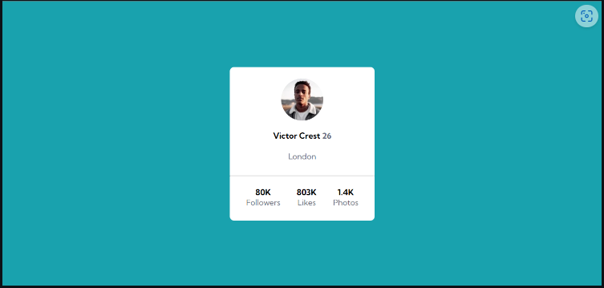

# Cartão de Perfil
Este projeto foi feito com o intuito de treinar e aperfeiçoar o uso do CSS Flexbox.

O objetivo era criar um Profile Card totalmente flexível e responsivo para diferentes tamanhos de tela, deixando o card centralizado no meio e alinhando todos os elementos dentro dele.

[]

[]

## Tecnologias utilizadas

- HTML
- CSS
